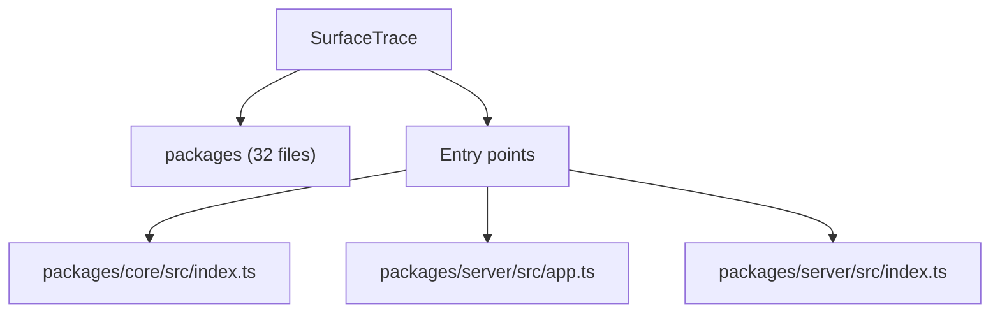

# Mental model: `SurfaceTrace`

*Generated by vibe-explainer in offline mode. This is an orientation aid, not a guarantee of correctness.*

## Overview

This repository contains roughly **32** code files (~**12,417** lines) with a primary stack signal of **JavaScript/TypeScript**. Likely entry points include: `packages/core/src/index.ts`, `packages/server/src/app.ts`, `packages/server/src/index.ts`. Top-level concentration: `packages`.

> Offline mode cannot recover original *intent*. Treat the above as structural observation only. Re-run with an LLM layer (when available) for a narrative hypothesis.

## Architecture sketch

*This diagram is a coarse directory/entry-point map, not a verified runtime architecture.*

## Start here

Open these in order:

1. `README.md` — Project orientation / stated purpose
2. `examples/controlled-replay-lab/README.md` — Project orientation / stated purpose
3. `package.json` — Dependencies and project metadata
4. `examples/controlled-replay-lab/package.json` — Dependencies and project metadata
5. `packages/core/package.json` — Dependencies and project metadata
6. `packages/core/src/index.ts` — Likely application or CLI entry point
7. `packages/server/src/app.ts` — Likely application or CLI entry point
8. `packages/server/src/index.ts` — Likely application or CLI entry point

## Key files (by weight)

- `packages/web/src/App.tsx` — 3312 lines
- `packages/server/src/app.ts` — 1711 lines
- `packages/server/test/app.test.ts` — 1125 lines
- `packages/web/test/investigation.test.tsx` — 1090 lines
- `packages/core/test/core.test.ts` — 1068 lines
- `packages/server/test/replay.test.ts` — 529 lines
- `packages/core/src/types.ts` — 401 lines
- `packages/server/src/persistence.ts` — 386 lines
- `packages/core/src/har/importHar.ts` — 349 lines
- `packages/core/src/threat/hypotheses.ts` — 313 lines

## Risk & opacity notes

From linked **vibe-check** report:

- vibe-check disposition: **FAST_TRACK**
- 4 duplicate code block(s) across files
- 5 giant file(s) (>1000 lines)

Structural signals from this scan:

- Large file: `packages/web/src/App.tsx` (3312 lines)
- Large file: `packages/server/src/app.ts` (1711 lines)
- Large file: `packages/server/test/app.test.ts` (1125 lines)
- Large file: `packages/web/test/investigation.test.tsx` (1090 lines)
- Large file: `packages/core/test/core.test.ts` (1068 lines)

## Suggested first questions

- What is the primary entry point and how does a request / CLI invocation flow from there?
- Where is configuration and environment handling defined?
- What are the main data models or core domain types?
- How are external services / APIs / databases reached?
- Which parts look intentionally temporary or experimental?

---
*vibe-explainer · 32 files · 12,417 lines · stack guess: JavaScript/TypeScript*